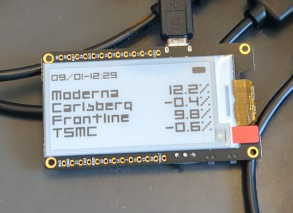

# esp32-ticker

ESP32 eink [Alpha vantage + RapidAPI](https://rapidapi.com/alphavantage/api/alpha-vantage) finance stock ticker

  

## Todo

- [ ] HTTP update from GitHub
- [ ] Configuration webserver
- [ ] Sleep more at night
- [ ] Webflasher for no code users

## Hardware Needed

- LILYGO® T5 2.13inch E-Paper Development Board
  - https://www.aliexpress.com/item/32869729970.html
  - https://www.mouser.dk/ProductDetail/DFRobot/DFR0676?qs=DPoM0jnrROUcIpTovbyZuA%3D%3D
- Battery (optional)

## Note

- Sleep current is 600uA
- API limit is [500 requests](https://rapidapi.com/alphavantage/api/alpha-vantage) per day

## Quick Guide

1. Create an account at rapidapi.com
2. Subscribe to https://rapidapi.com/alphavantage/api/alpha-vantage
3. Copy your `RapidAPI` token to https://github.com/ldab/esp32-ticker/blob/main/platformio.ini#L23
4. Add WiFi `SSID` and `Password` to https://github.com/ldab/esp32-ticker/blob/main/platformio.ini#L24
5. Change the stock symbols and bought price on https://github.com/ldab/esp32-ticker/blob/main/data/symbols.txt
6. PlatformIO -> Upload
7. PlatformIO -> Upload Filesystem Image

## Outro

- outro
